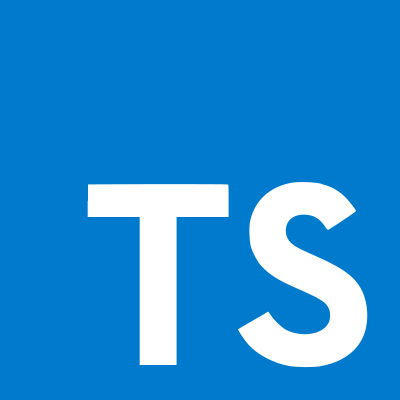
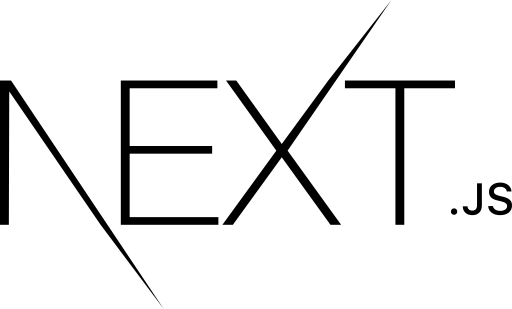
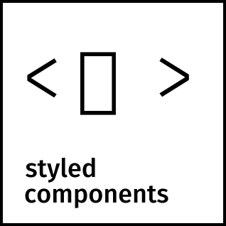
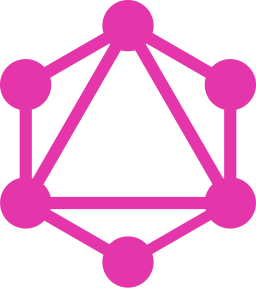
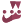
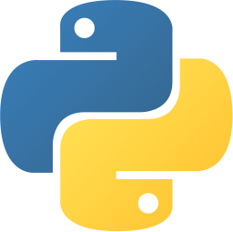

# Hi there, I&lsquo;m Arsam! 👋

🧑🏻‍💻 I am a software engineer, product maker and a lifelong learner. I build new products from scratch and make ideas happen!

- 💼 I'm excited to be staring my new role as a Senior Software Engineer at [Moo][moo]
- 🚧 I’m currently rebuilding [my personal website][arsam] using NextJs and Tailwind CSS
- 🌱 I’m learning Rust and brushing up on my VueJs
- ⭐️ Some of my goals for 2021 are:
  - ☑️ to contribute to more Open Source projects
  - ☑️ to start writting a technical blog

 
 

## Languages and Tools

These are some of the languages and tools that I am currently using in my projects

[][https://www.typescriptlang.org/]
[][https://reactjs.org/]
[][https://nextjs.org/]
[][https://styled-components.com/]
[][https://tailwindcss.com/]
[][https://graphql.org/]
[][https://jestjs.io/]
[][https://www.mongodb.com/]
[][https://www.python.org/]

 
 

## Github Stats

 
 

## Find me on 

[][linkedin]

[][instagram]

<!-- Definitions -->
[arsam]: https://arsam.dev
[linkedin]: https://linkedin.com/in/arsam
[instagram]: https://instagram.com/arsamsarabi
[moo]: https://moo.com/uk
